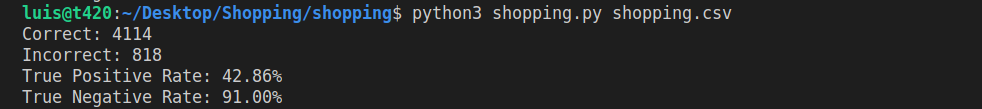

# Shopping

## An AI to predict whether online shopping customers will complete a purchase.

When users are shopping online, not all will end up purchasing something. Most visitors to an online shopping website, in fact, likely don’t end up going through with a purchase during that web browsing session. It might be useful, though, for a shopping website to be able to predict whether a user intends to make a purchase or not: perhaps displaying different content to the user, like showing the user a discount offer if the website believes the user isn’t planning to complete the purchase. How could a website determine a user’s purchasing intent? That’s where machine learning will come in.

The goal in this problem wass to build a nearest-neighbor classifier to solve this problem. Given information about a user — how many pages they’ve visited, whether they’re shopping on a weekend, what web browser they’re using, etc. — our classifier will predict whether or not the user will make a purchase. Our classifier won’t be perfectly accurate — perfectly modeling human behavior is a task well beyond the scope of this proyect — but it should be better than guessing randomly. To train our classifier, we’ll provide use some data from a shopping website from about 12,000 users sessions.

How do we measure the accuracy of a system like this? If we have a testing data set, we could run our classifier on the data, and compute what proportion of the time we correctly classify the user’s intent. This would give us a single accuracy percentage. But that number might be a little misleading. Imagine, for example, if about 15% of all users end up going through with a purchase. A classifier that always predicted that the user would not go through with a purchase, then, we would measure as being 85% accurate: the only users it classifies incorrectly are the 15% of users who do go through with a purchase. And while 85% accuracy sounds pretty good, that doesn’t seem like a very useful classifier.

Instead, we’ll measure two values: sensitivity (also known as the “true positive rate”) and specificity (also known as the “true negative rate”). Sensitivity refers to the proportion of positive examples that were correctly identified: in other words, the proportion of users who did go through with a purchase who were correctly identified. Specificity refers to the proportion of negative examples that were correctly identified: in this case, the proportion of users who did not go through with a purchase who were correctly identified. So our “always guess no” classifier from before would have perfect specificity (1.0) but no sensitivity (0.0). The goal was to build a classifier that performs reasonably on both metrics.

**Supervised Learning**

Supervised learning is a task where a computer learns a function that maps inputs to outputs based on a dataset of input-output pairs.

There are multiple tasks under supervised learning, and one of those is Classification. This is a task where the function maps an input to a discrete output. For example, given some information on humidity and air pressure for a particular day (input), the computer decides whether it will rain that day or not (output). The computer does this after training on a dataset with multiple days where humidity and air pressure are already mapped to whether it rained or not.

This task can be formalized as follows. We observe nature, where a function f(humidity, pressure) maps the input to a discrete value, either Rain or No Rain. This function is hidden from us, and it is probably affected by many other variables that we don’t have access to. Our goal is to create function h(humidity, pressure) that can approximate the behavior of function f. Such a task can be visualized by plotting days on the dimensions of humidity and rain (the input), coloring each data point in blue if it rained that day and in red if it didn’t rain that day (the output). The white data point has only the input, and the computer needs to figure out the output.

**Nearest-Neighbor Classification**

One way of solving a task like the one described above is by assigning the variable in question the value of the closest observation. So, for example, the white dot on the graph above would be colored blue, because the nearest observed dot is blue as well. This might work well some times, but consider the graph below.

Following the same strategy, the white dot should be colored red, because the nearest observation to it is red as well. However, looking at the bigger picture, it looks like most of the other observations around it are blue, which might give us the intuition that blue is a better prediction in this case, even though the closest observation is red.

One way to get around the limitations of nearest-neighbor classification is by using k-nearest-neighbors classification, where the dot is colored based on the most frequent color of the k nearest neighbors. It is up to the programmer to decide what k is. Using a 3-nearest neighbors classification, for example, the white dot above will be colored blue, which intuitively seems like a better decision.

A drawback of the k-nearest-neighbors classification is that, using a naive approach, the algorithm will have to measure the distance of every single point to the point in question, which is computationally expensive. This can be speed up by using data structures that enable finding neighbors more quickly or by pruning irrelevant observation.

**Scikit-learn**

There are multiple libraries that allow us to conveniently use machine learning algorithms. One of such libraries is scikit-learn. After importing the libraries, we can choose which model to use. The KNeighborsClassifier uses the k-neighbors strategy, and requires as input the number of neighbors it should consider. Since the algorithm is used often in a similar way, scikit-learn contains additional functions that make the code even more succinct and easy to use.

Now we can train our model on the data set and see if we can predict whether online shopping customers will complete a purchase or not.

## Implementation

`shopping.csv` contains the data set for this project. There are about 12,000 user sessions represented in this spreadsheet. The first six columns measure the different types of pages users have visited in the session: the `Administrative`, `Informational`, and `ProductRelated` columns measure how many of those types of pages the user visited, and their corresponding `_Duration` columns measure how much time the user spent on any of those pages. The `BounceRates`, `ExitRates`, and `PageValues` columns measure information from Google Analytics about the page the user visited. `SpecialDay` is a value that measures how closer the date of the user’s session is to a special day (like Valentine’s Day or Mother’s Day). `Month` is an abbreviation of the month the user visited. `OperatingSystems`, `Browser`, `Region`, and `TrafficType` are all integers describing information about the user themself. `VisitorType` will take on the value `Returning_Visitor` for returning visitors and some other string value for non-returning visitors. `Weekend` is `TRUE` or `FALSE` depending on whether or not the user is visiting on a weekend.

Perhaps the most important column, though, is the last one: the `Revenue` column. This is the column that indicates whether the user ultimately made a purchase or not: `TRUE` if they did, `FALSE` if they didn’t. This is the column that we’d predict (the “label”), based on the values for all of the other columns (the “evidence”).

At `shopping.py`, the main function loads data from the CSV spreadsheet by calling the `load_data` function and splits the data into a training and testing set. The `train_model` function is then called to train a machine learning model on the training data. Then, the model is used to make predictions on the testing data set. Finally, the `evaluate` function determines the sensitivity and specificity of the model, before the results are ultimately printed to the terminal.

**Specification**

The `load_data` function accepts the CSV filename as its argument, open that file, and return a tuple `(evidence, labels)`. `evidence` is a list of all of the evidence for each of the data points, and `labels` is a list of all of the labels for each data point.

Since there's one piece of evidence and one label for each row of the spreadsheet, the length of the `evidence` list and the length of the `labels` list is equal to the number of rows in the CSV spreadsheet (excluding the header row). The lists are ordered according to the order the users appear in the spreadsheet. That is to say, `evidence[0]` is the evidence for the first user, and `labels[0]` is the label for the first user.

Each element in the `evidence` list is itself a list. The list is of length 17: the number of columns in the spreadsheet excluding the final column (the label column).

The values in each evidence list are in the same order as the columns that appear in the evidence spreadsheet.

Note that, to build a nearest-neighbor classifier, all of our data needs to be numeric. So, the values are being converted to the following types:

- `Administrative`, `Informational`, `ProductRelated`, `Month`, `OperatingSystems`, `Browser`, `Region`, `TrafficType`, `VisitorType`, and `Weekend` are all of type `int`.

- `Administrative_Duration`, `Informational_Duration`, `ProductRelated_Duration`, `BounceRates`, `ExitRates`, `PageValues`, and `SpecialDay` are all of type `float`.

- `Month` is `0` for January, `1` for February, `2` for March, etc. up to `11` for December.

- `VisitorType` is `1` for returning visitors and `0` for non-returning visitors.

- `Weekend` is `1` if the user visited on a weekend and `0` otherwise.

- Each value of `labels` is either the integer `1`, if the user did go through with a purchase, or `0` otherwise.

For example, the value of the first evidence list is `[0, 0.0, 0, 0.0, 1, 0.0, 0.2, 0.2, 0.0, 0.0, 1, 1, 1, 1, 1, 1, 0]` and the value of the first label is `0`.

The `train_model function` accepts a list of evidence and a list of labels, and returns a scikit-learn nearest-neighbor classifier (a k-nearest-neighbor classifier where k = 1) fitted on that training data. By importing `KNeighborsClassifier` from `sklearn.neighbors` we can use a k-nearest-neighbors classifier in this function.

The `evaluate` function accepts a list of labels (the true labels for the users in the testing set) and a list of predictions (the labels predicted by our classifier), and returns two floating-point values `(sensitivity, specificity)`.

- `sensitivity` is a floating-point value from `0` to `1` representing the “true positive rate”: the proportion of actual positive labels that were accurately identified.

- `specificity` is a floating-point value from `0` to `1` representing the “true negative rate”: the proportion of actual negative labels that were accurately identified.

We assume that the list of true labels will contain at least one positive label and at least one negative label.

## Resources

* [Learning - Lecture 4 - CS50's Introduction to Artificial Intelligence with Python 2020][cs50 lecture]

## Usage

**To install Scikit-learn:**

* Inside the `shopping` directory: `pip3 install scikit-learn`

**To train and test a model to predict online shopping purchases:** 

* Inside the `shopping` directory: `python shopping.py shopping.csv`

## Credits

[*Luis Sanchez*][linkedin] 2021.

## Acknowledgements

Project and images from the course [CS50's Introduction to Artificial Intelligence with Python 2020][cs50 ai] from HarvardX.

Data set provided by [Sakar, C.O., Polat, S.O., Katircioglu, M. et al. Neural Comput & Applic (2018)][dataset].

[cs50 lecture]: https://www.youtube.com/watch?v=E4M_IQG0d9g
[linkedin]: https://www.linkedin.com/in/luis-sanchez-13bb3b189/
[cs50 ai]: https://cs50.harvard.edu/ai/2020/
[dataset]: https://link.springer.com/article/10.1007/s00521-018-3523-0
